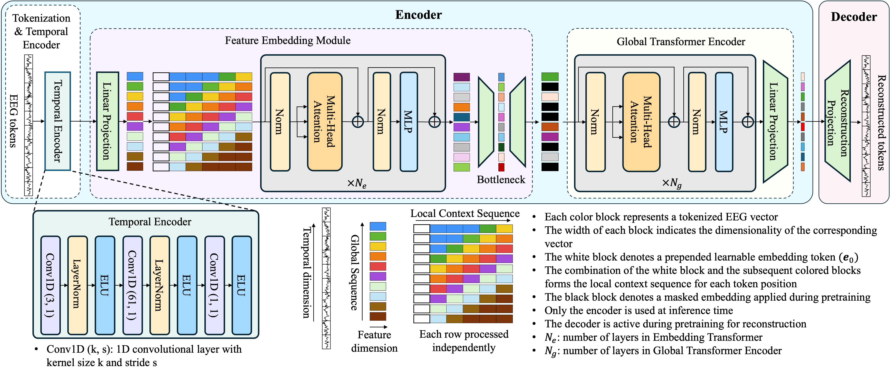

# SingLEM: A Foundation Model for Single-Channel EEG

This repository contains the official PyTorch implementation and pretrained model weights for the paper:

**SingLEM: Single-Channel Large EEG Model**  
*Jamiyan Sukhbaatar and Toshihisa Tanaka, Senior Member, IEEE*  
*Journal name* 
**[Link]**

## Abstract
> Current deep learning models for electroencephalography (EEG) are often task-specific and depend on large labeled datasets, limiting their adaptability. Although emerging foundation models aim for broader applicability, their rigid dependence on fixed, high-density multi-channel montages restricts their use across heterogeneous datasets, in missing-channel scenarios, and in practical low-channel settings. To address these limitations, we introduce SingLEM, a self-supervised foundation model that learns robust, general-purpose representations from single-channel EEG, making it inherently hardware-agnostic. The model employs a hybrid encoder architecture that combines convolutional layers to extract local features with a hierarchical Transformer to model both short- and long-range temporal dependencies. SingLEM is pretrained on 71 public datasets comprising over 9,200 subjects and 357,000 single-channel hours of EEG. When evaluated as a fixed feature extractor across six motor imagery and cognitive tasks, aggregated single-channel representations consistently outperformed leading multi-channel foundation models and handcrafted baselines. These results demonstrate that a single-channel approach can achieve state-of-the-art generalization while enabling fine-grained neurophysiological analysis and enhancing interpretability.

## Architecture of SingLEM
<p align="center">
  
</p>

## Installation

1.  Clone this repository:
    ```bash
    git clone https://github.com/ttlabtuat/SingLEM-EEG-Foundation-Model.git
    cd SingLEM-EEG-Foundation-Model
    ```
2.  Install the required packages:
    ```bash
    pip install -r requirements.txt
    ```

## Usage: Feature Extraction

Here is a simple example of how to load the pretrained SingLEM model, its weights, and extract features from a dummy EEG signal. For a more detailed guide, please see the Jupyter Notebook at `examples/feature_extraction_demo.ipynb`.

```python
import torch
from SingLEM.model import EEGEncoder, Config # Assumes model.py is in a 'SingLEM' directory

# 1. Initialize the model architecture with pretrained configuration
# Ensure mask_prob is set to 0.0 for feature extraction
config = Config()
config.mask_prob = 0.0
device = 'cuda' if torch.cuda.is_available() else 'cpu'
feature_extractor = EEGEncoder(config)

# 2. Load the pretrained weights
weights_path = 'weights/singlem_pretrained.pt'
encoder_state = torch.load(weights_path, map_location=device)
feature_extractor.load_state_dict(encoder_state)
feature_extractor = feature_extractor.to(device)
feature_extractor.eval() # Set the model to evaluation mode

# 3. Prepare a dummy single-channel EEG signal
# Shape: (batch_size, num_tokens, samples_per_token)
# Example: A batch of 1 sequence, with 10 one-second tokens (128 samples each).
dummy_eeg_sequence = torch.randn(1, 10, 128, device=device)

# 4. Extract features
with torch.no_grad():
    # The model returns features, masked indices, and sequence length.
    # We only need the first output for feature extraction.
    features, _, _ = feature_extractor(dummy_eeg_sequence)

print(f"Input shape: {dummy_eeg_sequence.shape}")
print(f"Output feature shape: {features.shape}")
# Expected input shape: torch.Size([1, 10, 128])
# Expected output shape: torch.Size([1, 10, 16])
```

## Downstream Task: SVM Training

We provide an example script, `examples/train_SVM_LOSO.py`, to demonstrate training a downstream SVM classifier using a Leave-One-Subject-Out (LOSO) cross-validation scheme.

### Data Preparation

The `train_SVM_LOSO.py` script expects the SingLEM features to be organized in a specific format:

1.  **File Structure:** Data for each subject must be saved as a separate `.pkl` file in a single directory (e.g., `data/MI/`). Files should be named with a consistent subject ID pattern, for example: `sub01.pkl`, `sub02.pkl`, `sub03.pkl`, etc.

2.  **Pickle File Content:** Each `.pkl` file must be a Python dictionary containing two keys:
    *   `'data'`: A NumPy array of raw EEG trials for the subject, with shape `(num_trials, num_channels, num_samples)`.
    *   `'labels'`: A NumPy array of corresponding labels for each trial, with shape `(num_trials,)`.

3.  **Subject List:** You must define the list of your subject file prefixes inside the `train_SVM_LOSO.py` script. Open the file and modify the `SUBJECTS` list to match your filenames:
    ```python
    # Inside examples/train_SVM_LOSO.py
    def main():
        args = parse_args()
        
        # --- MODIFY THIS LIST TO MATCH YOUR SUBJECT FILENAMES ---
        SUBJECTS = ['sub01', 'sub02', 'sub03', 'sub04', ...] 
        ...
    ```

### Running the SVM Training

Once your data is prepared and the subject list is updated, run the training script from the project's root directory:

```bash
python examples/train_SVM_LOSO.py --data_dir /path/to/your/pkl_files
```

The script will automatically handle feature extraction, LOSO splitting, SVM training, and will save the final classification results to a `results.txt` file.

## Citation

If you use this work useful, please citing our paper:

```bibtex
@misc{SingLEM,
      title={SingLEM: Single-Channel Large EEG Model}, 
      author={Jamiyan Sukhbaatar, Satoshi Imamura, Ibuki Inoue, Shoya Murakami, Kazi Mahmudul Hassan, Seungwoo Han and Ingon Chanpornpakdi, and Toshihisa Tanaka},
      year={2025},
      eprint={2509.17920},
      archivePrefix={arXiv},
      primaryClass={cs.LG},
      url={https://arxiv.org/abs/2509.17920}, 
}
```