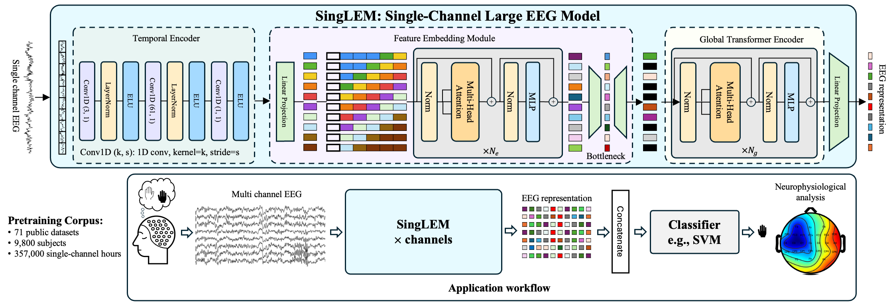
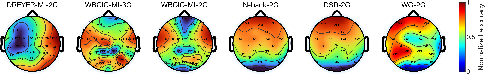

# SingLEM: Single-Channel Large EEG Model

Official implementation of **SingLEM**, a self-supervised EEG foundation model
that learns a reusable representation from single-channel EEG. The same encoder
is applied independently to every available electrode, so it can be used with
different channel counts and electrode layouts. For multi-channel decoding, the
channel-wise features are concatenated before the downstream classifier.

This repository is organized as a public reproduction package for the revised
manuscript. It includes the SingLEM model code and checkpoints, raw-data
preprocessing code, model-specific feature extraction code, strict and
subject-adapted LOSO experiment runners, standardized result files, and the
scripts that regenerate the README tables from those result files.

> The previous public GitHub layout is preserved in the `legacy-original`
> branch. The `main` branch contains the revised reproduction package and is
> the default branch.



## What SingLEM Is

SingLEM is designed for heterogeneous EEG recordings where the available
electrodes, sampling rates, and downstream tasks differ across datasets. Instead
of pretraining one encoder tied to a fixed multi-channel montage, SingLEM learns
from individual EEG channels. This makes the pretrained encoder reusable when a
new dataset has only a subset of electrodes or a different layout.

The encoder takes 1-second EEG tokens sampled at 128 Hz. A CNN feature encoder
extracts short-range temporal features from each token. A feature-embedding
module uses a small context transformer over neighboring token features to
provide short-range context. A 12-layer global transformer encoder with hidden
size 128 and 8 attention heads models the sequence. The final projection
produces a compact 16-dimensional representation for each token. During
downstream evaluation, `mask_prob` is set to `0.0` and only the encoder
representation is used.

SingLEM was pretrained with a masked-autoencoder-style self-supervised
objective. The full pretraining corpus used by the downstream-included
checkpoint contains 71 public EEG datasets, over 10,200 hours of multi-channel
EEG, and more than 357,000 single-channel hours from over 9,200 subjects. The
primary benchmark checkpoint excludes the three source datasets that generate
the six downstream evaluation tasks. The decoder and masking module are used for
pretraining only; the frozen encoder is used for the benchmark results in this
repository.

In the final revised manuscript, the preprocessing was corrected so that
high-amplitude samples are removed and treated as boundaries between continuous
clean EEG segments. Training sequences are sampled within a single clean
segment, so a sequence never crosses an artifact boundary. After this correction
all three SingLEM configurations were retrained, and all SingLEM-dependent
benchmark results and topographical maps were regenerated.

## What Is Included

```text
SingLEM/                 SingLEM encoder code and included checkpoints
preprocessing/           raw-dataset trial builders and feature extractors
models/foundation/       external foundation-model source/checkpoint placeholders
models/neural/           EEGNet, EEGConformer, and IFNetV2 baselines
experiments/             strict LOSO and 30% subject-adapted runners
analysis/                package validation and README result-table generation
configs/                 dataset, model, and experiment configuration
raw_datasets/            exact zero-byte placeholders for raw source files
datasets/trials/         exact zero-byte placeholders for generated trial files
datasets/features/       exact zero-byte placeholders for generated features
results/                 revised manuscript results, metadata, and summaries
```

All code needed for the revised downstream benchmark workflow is included. This
public package reproduces the downstream benchmark and provides the released
pretrained SingLEM checkpoints; it does not package the full large-scale
71-dataset pretraining pipeline for rebuilding the checkpoints from scratch. The
repository does not redistribute raw EEG recordings, generated trial/feature
arrays, or external competing-model checkpoints because those files are large or
governed by original dataset/model licenses. Their expected paths are
represented by zero-byte placeholders. Download each external artifact from its
original source and replace the matching placeholder at the same path.

## Checkpoints

The SingLEM source code and three final retrained SingLEM checkpoints are included under
`SingLEM/checkpoints/`:

| Checkpoint | Pretraining corpus | Use |
| --- | --- | --- |
| `singlem_downstream_excluded.pt` | **SingLEM (primary)**. Self-supervised pretraining used 68 datasets after excluding the three source datasets underlying the six downstream tasks: `Dreyer_MI_25`, `WBCIC_MI_23`, and `ATTEN_28`. | Main benchmark and single-channel analysis |
| `singlem_downstream_included.pt` | **SingLEM (all 71 datasets)**. Same architecture and training procedure on the full 71-dataset corpus. | General reuse and downstream-included ablation |
| `singlem_no_feature_embedding.pt` | **SingLEM (w/o feature emb.)**. Same 68-dataset corpus as SingLEM (primary), with the feature embedding module removed. | Architecture ablation |

The older compatibility alias `singlem_pretrained.pt` is not part of the revised
`main` branch and is not used by any reproduction command.

Use `singlem_downstream_excluded.pt` for the main benchmark and
individual-channel analysis.

## Installation

Create an environment for the PyTorch code and install the requirements:

```bash
git clone https://github.com/ttlabtuat/SingLEM.git
cd SingLEM
pip install -r requirements.txt
```

The GPU SVM runs use RAPIDS/cuML and normally require a separate RAPIDS
environment. See [`RAPIDS.md`](RAPIDS.md) for the expected setup.

## External Models And Data

External foundation-model source files are included only when redistribution is
allowed. Otherwise, source files and checkpoints are represented by zero-byte
placeholders under `models/foundation/`. Two setup styles are supported. Users
may replace only the exact placeholder files listed in each model README, or
they may download the full upstream repository and run `setup_models.py
--install` to copy the required files into the canonical paths used by the
feature extractors. Extra upstream files are ignored. Some upstream repositories
do not contain pretrained weights on GitHub, so their checkpoints must still be
downloaded from the listed release, HuggingFace page, or other official source.
See [`models/foundation/README.md`](models/foundation/README.md), then verify
the setup:

```bash
python models/foundation/setup_models.py --verify
```

Keep the raw-dataset placeholder paths unchanged. If your file manager creates
sibling folders such as `ATTEN_28 copy`, the preprocessing scripts will not use
those folders. Merge downloaded raw-dataset contents into the existing
placeholder tree so the real files replace zero-byte files at the same relative
paths.

Foundation-model feature extractors always read the canonical runtime folders
such as `models/foundation/bendr/` and `models/foundation/biot/`. Full upstream
repositories can be staged separately and normalized with `setup_models.py
--install`; the setup script copies only the required files into the canonical
folders. If your file manager creates names such as `BENDR-main copy`, prefer
renaming them to clean upstream names, or run `setup_models.py --dry_run` before
installation to confirm which files will be copied.

For full upstream repositories, the recommended paste location is a staging
folder named `foundation_models/` at the repository root:

```text
SingLEM/
  SingLEM/                 included SingLEM code and checkpoints
  foundation_models/
    BENDR-main/
    BIOT-main/
    LaBraM-main/
    CBraMod-main/
    CodeBrain-main/
    CSBrain-main/
    BioFoundation-main/
    MIRepNet-main/
```

Do not place SingLEM itself under `foundation_models/`. SingLEM is not treated
as an external foundation model in this repository.

A second supported location is beside the canonical placeholder folders:

```text
SingLEM/
  models/foundation/
    bendr/             canonical runtime folder with placeholders
    biot/              canonical runtime folder with placeholders
    BENDR-main/        full upstream repository
    BIOT-main/         full upstream repository
```

After placing full repositories there and downloading any separate checkpoints,
normalize the required files into `models/foundation/` with:

```bash
python models/foundation/setup_models.py --install --verify
```

The six downstream tasks are derived from three public source datasets:

- Dreyer-MI-2C
- WBCIC-MI-2C and WBCIC-MI-3C
- EEG-NIRS cognitive tasks: N-back-2C, DSR-2C, and WG-2C

The `raw_datasets/` placeholder tree mirrors the exact paths used by the
preprocessing code. Replace the zero-byte files with the real downloaded files.
Do not change the directory layout unless you also update the configuration.
For example, real ATTEN files must end up under `raw_datasets/ATTEN_28/`, not
under a sibling folder such as `raw_datasets/ATTEN_28 copy/`.
Dataset article PDFs, supplementary PDFs, notebooks, and one-off conversion
helper scripts are not required by the public preprocessing pipeline and are not
included as placeholders.

## Preprocessing Is Included

All preprocessing needed for the benchmark is implemented in this repository.
The trial builders perform notch filtering, band-pass filtering, resampling,
unit conversion, artifact rejection, trial extraction, and model-specific
normalization. Samples exceeding the configured amplitude threshold are removed
and treated as boundaries between continuous clean EEG segments. Feature
extractors then apply each foundation model's channel policy before running the
frozen encoder.

The main model-specific preprocessing settings are:

| Model | Trial preprocessing | Feature/channel handling |
|---|---|---|
| SingLEM | 50 Hz notch, 0.5-50 Hz band-pass, 128 Hz, microvolts scaled by 0.01 | uses every available channel independently |
| BENDR | 50 Hz notch, 0.5-50 Hz band-pass, 256 Hz | maps to 19 pretrained channels, zero-fills missing channels, applies relative-amplitude scaling |
| BIOT | 50 Hz notch, 0.5-50 Hz band-pass, 200 Hz | builds BIOT bipolar channels plus C3/C4, zero-fills missing channels, applies per-trial p95 amplitude normalization |
| LaBraM | 50 Hz notch, 0.1-75 Hz band-pass, 200 Hz, microvolts scaled by 0.01 | uses available channels |
| CBraMod | 50 Hz notch, 0.3-75 Hz band-pass, 200 Hz, microvolts scaled by 0.01 | selects matched pretrained 19-channel inputs, with configured substitutions for cognitive datasets |
| CSBrain | 50 Hz notch, 0.1-75 Hz band-pass, 200 Hz, microvolts scaled by 0.01 | selects matched pretrained 19-channel inputs and supplies CSBrain channel-order metadata |
| LUNA-large | 50 Hz notch, 0.1-75 Hz band-pass, 256 Hz | applies per-trial per-channel z-score normalization |
| MIRepNet | 50 Hz notch, 8-30 Hz band-pass, 250 Hz; MI datasets only | interpolates to the MIRepNet 45-channel template and applies Euclidean Alignment |
| CSP | uses generated trial files, then fits CSP only on each training fold | 8-30 Hz CSP with up to 6 components |
| Welch PSD | uses generated trial files, then computes PSD only from each fold's data | log-PSD features in the 4-40 Hz band |

The default feature-extraction channel policy is `pretrained_matched`, which is
the policy used for the benchmark tables.

## Reproducing The Pipeline

Run the commands in this section from the repository root:

```bash
cd /path/to/SingLEM
```

Relative paths such as `raw_datasets` and `datasets/trials` are resolved from
the current shell directory. If you run a script from another directory, pass
absolute paths for `--raw_root`, `--input_root`, `--output_root`, and
`--result_root`.

Validate the package before adding external data:

```bash
python analysis/validate.py --package_root . --portable --raw_package
```

Build model-specific trial files:

```bash
python preprocessing/build_trials/build_all_trials.py \
  --raw_root raw_datasets \
  --output_root datasets/trials \
  --datasets dreyer,wbcic_2c,wbcic_3c,atten_nback,atten_dsr,atten_word \
  --models singlem,bendr,biot,labram,cbramod,csbrain,codebrain,luna_large,mirepnet \
  --n_jobs 32 \
  --overwrite
```

To build trials for only one dataset/model pair, pass one dataset ID and one
model ID:

```bash
python preprocessing/build_trials/build_all_trials.py \
  --raw_root raw_datasets \
  --output_root datasets/trials \
  --datasets dreyer \
  --models singlem \
  --n_jobs 8 \
  --overwrite
```

Extract frozen foundation-model features for all benchmark datasets and
foundation models with one command:

```bash
python preprocessing/extract_features/extract_all_features.py \
  --datasets dreyer,wbcic_2c,wbcic_3c,atten_nback,atten_dsr,atten_word \
  --models singlem,bendr,biot,labram,cbramod,csbrain,codebrain,luna_large,mirepnet \
  --singlem_variants all \
  --channel_policy pretrained_matched \
  --input_root datasets/trials \
  --output_root datasets/features \
  --gpu 0 \
  --overwrite
```

`extract_all_features.py` calls `extract_foundation_features.py` for each
dataset/model pair and skips MIRepNet on cognitive datasets because MIRepNet is
MI-specific. The command above is written over multiple shell lines only for
readability; it is one command. It includes `--singlem_variants all` so the
main downstream-excluded SingLEM features and the two SingLEM ablation feature
sets are generated together. To extract only one dataset/model pair, run the
lower-level command:

```bash
python preprocessing/extract_features/extract_foundation_features.py \
  --dataset <dataset> \
  --model <model> \
  --channel_policy pretrained_matched \
  --input_root datasets/trials \
  --output_root datasets/features \
  --gpu 0 \
  --overwrite
```

For SingLEM, the default variant is `downstream_excluded` and outputs are written
to `datasets/features/<dataset>/singlem/downstream_excluded/`. Use
`--singlem_variants all` with `extract_all_features.py`, or
`--singlem_variant downstream_included` / `--singlem_variant no_feature_embedding`
with `extract_foundation_features.py`, to reproduce the ablation variants.

Run a minimal SingLEM forward pass:

```python
import torch

from SingLEM.model import Config, EEGEncoder

device = torch.device("cuda" if torch.cuda.is_available() else "cpu")
config = Config()
payload = torch.load(
    "SingLEM/checkpoints/singlem_downstream_excluded.pt",
    map_location=device,
    weights_only=True,
)
for name, value in payload["model_config"].items():
    setattr(config, name, value)
config.mask_prob = 0.0
model = EEGEncoder(config).to(device)
model.load_state_dict(payload["encoder_state_dict"])
model.eval()

# Shape: batch, tokens, samples_per_token. One token is 1 second at 128 Hz.
x = torch.randn(1, 10, 128, device=device)
with torch.no_grad():
    features, _, _ = model(x)
print(features.shape)  # (1, 10, 16)
```

For complete feature extraction, use the preprocessing commands above. They
apply the same channel handling, scaling, and model-specific preprocessing used
for the benchmark tables.

## Experiments

The benchmark uses leave-one-subject-out (LOSO) evaluation. In strict LOSO, one
subject is held out for testing. The remaining subjects are split into
source-training and source-validation data for hyperparameter or epoch
selection, then the final classifier is refit on all source subjects and
evaluated once on the held-out subject. No target-subject trials are used for
feature scaling, model selection, or training in strict LOSO.

The 30% subject-adapted setting uses class-balanced calibration trials from the
held-out subject with seed 2023. The remaining target trials are kept untouched
for final testing. Feature-based models refit the final classifier with source
data plus target calibration data. Supervised neural decoders freeze the
source-trained backbone and adapt only the existing classifier head.

Available experiment groups are:

- `strict_svm_foundation`
- `strict_svm_classical`
- `strict_svm_singlem_ablation`
- `strict_svm_single_channel`
- `strict_mlp`
- `strict_mlp_classical`
- `strict_neural`
- `adapted_mlp_foundation`
- `adapted_mlp_classical`
- `adapted_neural`

Inspect all configured jobs without launching training:

```bash
python experiments/run_all.py --gpus 0 --dry_run
```

Inspect only one SingLEM GPU-SVM ablation job:

```bash
python experiments/run_all.py \
  --experiments strict_svm_singlem_ablation \
  --datasets dreyer \
  --models downstream_included \
  --dry_run
```

Run the full suite with separate PyTorch and RAPIDS interpreters:

```bash
export PYTORCH_PYTHON=/path/to/pytorch/python
export RAPIDS_PYTHON=/path/to/rapids/python
python experiments/run_all.py --gpus 0 --keep_going
```

Use as many GPU IDs as are available on your machine, for example `--gpus 0 1`
on a two-GPU server. Multiple GPU IDs let the runner schedule independent jobs
in parallel; they are not required for correctness. A single GPU is sufficient,
but slower. GPU/cuML SVM jobs require a RAPIDS environment and an NVIDIA GPU.
PyTorch MLP and neural jobs can run on CPU if the relevant runner is launched
without CUDA, but the full public reproduction suite includes GPU/cuML SVM
experiments and therefore cannot be reproduced completely on a CPU-only machine.
CPU-only users can still run preprocessing, validation, and non-cuML experiment
groups.

Published result files are skipped fold by fold when already complete. For a new
independent rerun, write to a separate result directory:

```bash
python experiments/run_all.py \
  --result_root /path/to/reproduced_results \
  --gpus 0 --keep_going
```

After generating all trials and features, validate the completed package:

```bash
python analysis/validate.py --package_root . --portable
```

## Results And SVM Backends

Canonical subject-level results, summaries, and run metadata are stored under
[`results/`](results/). Every result table in this README is generated from
`summary.csv` files by:

```bash
python analysis/build_result_tables.py
```

The main SVM result source is the strict LOSO GPU/cuML result tree under
`results/strict/svm/`. These are the manuscript-main SVM values for the public
release and are the only SVM backend used in the README benchmark tables.

SingLEM ablation rows use the same GPU/cuML SVM protocol. The primary
`downstream_excluded` checkpoint is reported from
`results/strict/svm/foundation/singlem/<dataset>/`. The
`downstream_included` and `no_feature_embedding` ablations are reported from
`results/ablation/gpu_svm/singlem/<variant>/<dataset>/`.

Single-channel interpretability results are stored separately under
`results/single_channel/gpu_svm/singlem/downstream_excluded/`. These are the
per-electrode values underlying the topographical maps in the revised
manuscript.



Each result directory records its backend and source in `run_metadata.json`.
Accuracy and macro-F1 are reported as percentages. Cohen's kappa is reported on
its original scale. Sample standard deviation is used for the generated
summaries to match the manuscript aggregation convention. Bold values mark the
best mean result among the primary comparison methods. SingLEM ablation rows in
the SVM tables are shown for direct comparison but are excluded from the primary
ranking.

<!-- RESULTS_TABLES_START -->

### Strict LOSO GPU/cuML SVM Results on MI Tasks

| Model | Dreyer-2C | WBCIC-3C | WBCIC-2C |
|---|---|---|---|
| BENDR | Acc 52.23±2.71 / F1 51.85±2.76 / κ 0.045±0.054 | Acc 35.50±2.76 / F1 35.39±2.86 / κ 0.032±0.041 | Acc 51.09±3.71 / F1 50.96±3.81 / κ 0.022±0.074 |
| BIOT | Acc 52.83±6.05 / F1 50.85±7.72 / κ 0.057±0.121 | Acc 35.95±4.36 / F1 33.23±5.09 / κ 0.039±0.065 | Acc 50.83±3.53 / F1 50.26±3.75 / κ 0.017±0.071 |
| LaBraM | Acc 55.00±6.56 / F1 53.65±6.81 / κ 0.100±0.131 | Acc 39.89±5.82 / F1 36.70±6.77 / κ 0.098±0.087 | Acc 57.24±5.97 / F1 56.51±6.22 / κ 0.145±0.119 |
| CBraMod | Acc 71.16±8.89 / F1 70.68±9.44 / κ 0.423±0.178 | Acc 60.20±10.76 / F1 59.23±11.13 / κ 0.403±0.161 | Acc 78.14±11.14 / F1 77.90±11.43 / κ 0.563±0.223 |
| CodeBrain | Acc 65.09±6.86 / F1 64.39±7.24 / κ 0.302±0.137 | Acc 51.53±9.54 / F1 49.53±10.86 / κ 0.273±0.143 | Acc 74.17±11.94 / F1 73.85±12.23 / κ 0.483±0.239 |
| CSBrain | Acc 68.96±11.94 / F1 68.61±12.18 / κ 0.379±0.239 | Acc 63.05±13.81 / F1 62.98±13.85 / κ 0.446±0.207 | Acc 79.29±12.76 / F1 79.19±12.85 / κ 0.586±0.255 |
| LUNA | Acc 59.58±7.03 / F1 59.16±7.07 / κ 0.192±0.141 | Acc 45.35±6.30 / F1 43.96±6.60 / κ 0.180±0.094 | Acc 62.27±9.00 / F1 61.91±9.07 / κ 0.245±0.180 |
| MIRepNet | Acc 72.68±17.40 / F1 72.49±17.56 / κ 0.454±0.348 | Acc 48.28±12.64 / F1 47.60±13.11 / κ 0.224±0.190 | Acc 61.26±10.87 / F1 60.83±10.99 / κ 0.225±0.217 |
| CSP | Acc 62.56±14.27 / F1 58.58±17.71 / κ 0.251±0.285 | Acc 34.77±2.28 / F1 28.57±5.71 / κ 0.022±0.034 | Acc 49.71±3.66 / F1 44.98±5.54 / κ -0.006±0.073 |
| Welch PSD | Acc 55.98±7.40 / F1 53.52±9.65 / κ 0.120±0.148 | Acc 37.65±5.51 / F1 28.62±11.27 / κ 0.065±0.083 | Acc 54.34±5.03 / F1 51.40±7.48 / κ 0.087±0.101 |
| SingLEM (primary) | **Acc 74.58±8.15** / **F1 74.45±8.24** / **κ 0.492±0.163** | **Acc 68.14±12.95** / **F1 68.03±12.99** / **κ 0.522±0.194** | **Acc 79.68±13.42** / **F1 79.60±13.49** / **κ 0.594±0.268** |
| SingLEM (all 71 datasets) | Acc 74.52±8.05 / F1 74.40±8.09 / κ 0.490±0.161 | Acc 68.17±12.46 / F1 68.02±12.54 / κ 0.523±0.187 | Acc 79.48±13.30 / F1 79.39±13.38 / κ 0.590±0.266 |
| SingLEM (w/o feature emb.) | Acc 71.93±8.51 / F1 71.76±8.59 / κ 0.439±0.170 | Acc 66.08±12.57 / F1 65.93±12.66 / κ 0.491±0.189 | Acc 78.21±13.81 / F1 78.11±13.88 / κ 0.564±0.276 |

### Strict LOSO GPU/cuML SVM Results on Cognitive Tasks

| Model | N-back-2C | DSR-2C | WG-2C |
|---|---|---|---|
| BENDR | Acc 62.75±5.69 / F1 62.19±6.16 / κ 0.255±0.114 | Acc 59.62±7.36 / F1 58.85±7.89 / κ 0.192±0.147 | Acc 50.00±9.13 / F1 49.21±9.38 / κ -0.000±0.183 |
| BIOT | Acc 60.47±9.78 / F1 57.99±12.53 / κ 0.209±0.196 | Acc 61.70±9.04 / F1 60.06±9.81 / κ 0.234±0.181 | Acc 57.18±7.86 / F1 55.15±9.77 / κ 0.144±0.157 |
| LaBraM | Acc 62.25±8.45 / F1 59.68±11.48 / κ 0.245±0.169 | Acc 66.72±11.96 / F1 65.50±13.12 / κ 0.334±0.239 | Acc 61.54±8.87 / F1 57.45±12.82 / κ 0.231±0.177 |
| CBraMod | Acc 78.03±9.98 / F1 76.63±12.40 / κ 0.561±0.200 | Acc 79.38±9.84 / F1 78.51±10.94 / κ 0.588±0.197 | Acc 69.94±8.35 / F1 68.86±9.09 / κ 0.399±0.167 |
| CodeBrain | Acc 80.13±10.33 / F1 79.16±12.40 / κ 0.603±0.207 | Acc 82.00±9.54 / F1 81.47±10.22 / κ 0.640±0.191 | Acc 66.35±9.65 / F1 63.60±13.01 / κ 0.327±0.193 |
| CSBrain | Acc 78.13±8.38 / F1 77.56±8.85 / κ 0.563±0.168 | Acc 76.44±10.92 / F1 75.67±11.71 / κ 0.529±0.218 | Acc 68.01±7.67 / F1 66.78±8.79 / κ 0.360±0.153 |
| LUNA | Acc 69.37±9.57 / F1 68.15±10.46 / κ 0.387±0.191 | Acc 70.73±8.81 / F1 69.39±9.97 / κ 0.415±0.176 | Acc 58.59±9.63 / F1 54.38±12.45 / κ 0.172±0.193 |
| CSP | Acc 58.37±8.44 / F1 53.92±11.89 / κ 0.167±0.169 | Acc 56.41±8.56 / F1 49.06±12.59 / κ 0.128±0.171 | Acc 53.53±10.01 / F1 48.46±13.09 / κ 0.071±0.200 |
| Welch PSD | Acc 64.78±8.67 / F1 60.88±12.37 / κ 0.296±0.173 | Acc 62.29±9.53 / F1 56.90±13.79 / κ 0.246±0.191 | Acc 61.47±8.33 / F1 56.84±13.03 / κ 0.229±0.167 |
| SingLEM (primary) | **Acc 84.15±9.34** / **F1 83.57±11.32** / **κ 0.683±0.187** | **Acc 85.68±8.75** / **F1 85.46±9.07** / **κ 0.714±0.175** | **Acc 70.26±8.26** / **F1 69.68±8.70** / **κ 0.405±0.165** |
| SingLEM (all 71 datasets) | Acc 84.37±9.77 / F1 83.71±11.95 / κ 0.687±0.195 | Acc 85.90±8.53 / F1 85.69±8.84 / κ 0.718±0.171 | Acc 69.62±8.68 / F1 69.23±8.85 / κ 0.392±0.174 |
| SingLEM (w/o feature emb.) | Acc 83.65±9.70 / F1 83.05±11.66 / κ 0.673±0.194 | Acc 85.52±8.86 / F1 85.20±9.36 / κ 0.710±0.177 | Acc 69.55±8.49 / F1 68.99±8.84 / κ 0.391±0.170 |

### Strict LOSO MLP and Neural Results

| Model | Dreyer-2C | WBCIC-3C | WBCIC-2C | N-back-2C | DSR-2C | WG-2C |
|---|---|---|---|---|---|---|
| SingLEM (primary) | **Acc 73.63±8.81** / **F1 73.50±8.88** / **κ 0.473±0.176** | **Acc 67.44±13.57** / **F1 67.28±13.63** / **κ 0.512±0.204** | **Acc 79.83±13.67** / **F1 79.74±13.76** / **κ 0.597±0.273** | **Acc 82.80±9.95** / **F1 82.61±10.30** / **κ 0.656±0.199** | **Acc 83.87±9.23** / **F1 83.56±9.80** / **κ 0.677±0.185** | Acc 68.78±7.74 / F1 68.52±7.91 / κ 0.376±0.155 |
| BENDR | Acc 49.49±1.53 / F1 34.83±3.18 / κ -0.010±0.031 | Acc 35.43±2.92 / F1 32.78±3.30 / κ 0.032±0.044 | Acc 50.82±3.76 / F1 48.59±5.54 / κ 0.016±0.075 | Acc 56.87±6.07 / F1 54.29±8.18 / κ 0.137±0.121 | Acc 54.43±6.60 / F1 49.89±9.74 / κ 0.089±0.132 | Acc 51.15±4.44 / F1 42.82±8.21 / κ 0.023±0.089 |
| BIOT | Acc 50.18±5.31 / F1 47.21±6.84 / κ 0.004±0.106 | Acc 35.62±2.67 / F1 32.47±4.26 / κ 0.034±0.040 | Acc 49.82±4.19 / F1 47.61±5.08 / κ -0.004±0.084 | Acc 58.12±8.46 / F1 53.44±13.01 / κ 0.162±0.169 | Acc 59.56±9.62 / F1 55.77±12.93 / κ 0.191±0.192 | Acc 53.53±8.75 / F1 49.27±11.26 / κ 0.071±0.175 |
| LaBraM | Acc 54.67±5.69 / F1 52.22±6.72 / κ 0.093±0.114 | Acc 37.56±4.22 / F1 33.66±5.15 / κ 0.063±0.063 | Acc 51.59±3.04 / F1 48.40±5.29 / κ 0.032±0.061 | Acc 59.69±7.71 / F1 53.94±13.02 / κ 0.194±0.154 | Acc 60.63±9.05 / F1 56.79±13.00 / κ 0.213±0.181 | Acc 61.09±12.29 / F1 56.27±16.69 / κ 0.222±0.246 |
| CBraMod | Acc 70.57±8.49 / F1 70.08±9.03 / κ 0.411±0.170 | Acc 60.81±10.24 / F1 59.87±10.41 / κ 0.412±0.154 | Acc 78.49±11.54 / F1 78.18±12.05 / κ 0.570±0.231 | Acc 75.85±11.08 / F1 74.29±13.52 / κ 0.517±0.222 | Acc 77.78±9.84 / F1 76.81±11.47 / κ 0.556±0.197 | **Acc 70.45±7.94** / **F1 69.46±8.68** / **κ 0.409±0.159** |
| CodeBrain | Acc 65.74±7.36 / F1 64.75±8.05 / κ 0.315±0.147 | Acc 53.68±9.03 / F1 51.76±10.14 / κ 0.305±0.135 | Acc 74.25±12.23 / F1 73.89±12.69 / κ 0.485±0.245 | Acc 78.31±11.33 / F1 76.81±14.66 / κ 0.566±0.227 | Acc 81.89±9.69 / F1 81.33±10.39 / κ 0.638±0.194 | Acc 67.18±9.37 / F1 64.63±12.62 / κ 0.344±0.187 |
| CSBrain | Acc 68.39±11.16 / F1 67.81±11.53 / κ 0.368±0.223 | Acc 64.20±14.35 / F1 63.91±14.41 / κ 0.463±0.215 | Acc 79.36±12.81 / F1 79.15±13.03 / κ 0.587±0.256 | Acc 77.56±8.13 / F1 76.92±8.64 / κ 0.551±0.163 | Acc 75.80±10.72 / F1 75.07±11.47 / κ 0.516±0.214 | Acc 65.38±8.22 / F1 63.98±10.16 / κ 0.308±0.164 |
| LUNA | Acc 57.23±7.73 / F1 55.83±8.76 / κ 0.145±0.155 | Acc 41.80±5.40 / F1 39.33±7.09 / κ 0.127±0.081 | Acc 59.56±8.21 / F1 58.72±8.54 / κ 0.191±0.164 | Acc 63.28±10.49 / F1 59.03±14.72 / κ 0.266±0.210 | Acc 64.64±10.24 / F1 62.45±12.52 / κ 0.293±0.205 | Acc 59.68±9.32 / F1 55.51±12.90 / κ 0.194±0.186 |
| MIRepNet | Acc 73.04±17.61 / F1 72.80±17.85 / κ 0.461±0.352 | Acc 48.71±12.41 / F1 48.29±12.49 / κ 0.231±0.186 | Acc 61.73±10.87 / F1 61.30±11.01 / κ 0.235±0.218 | -- | -- | -- |
| CSP | Acc 64.49±13.93 / F1 61.34±16.87 / κ 0.290±0.279 | Acc 35.01±2.56 / F1 26.07±7.59 / κ 0.025±0.039 | Acc 50.12±2.61 / F1 41.96±6.71 / κ 0.002±0.052 | Acc 57.94±10.15 / F1 48.33±16.20 / κ 0.159±0.203 | Acc 57.64±8.39 / F1 48.78±14.46 / κ 0.153±0.168 | Acc 54.74±9.11 / F1 46.37±13.85 / κ 0.095±0.182 |
| Welch PSD | Acc 56.19±7.52 / F1 54.06±9.64 / κ 0.124±0.150 | Acc 38.28±5.39 / F1 30.55±10.56 / κ 0.074±0.081 | Acc 54.78±5.10 / F1 52.13±7.66 / κ 0.096±0.102 | Acc 66.38±8.61 / F1 63.17±11.47 / κ 0.328±0.172 | Acc 64.74±9.98 / F1 60.34±13.83 / κ 0.295±0.200 | Acc 61.22±10.85 / F1 55.75±15.36 / κ 0.224±0.217 |
| EEGNet | Acc 73.10±10.50 / F1 72.66±11.07 / κ 0.462±0.210 | Acc 60.53±11.16 / F1 59.77±10.97 / κ 0.408±0.167 | Acc 73.01±13.35 / F1 71.17±15.45 / κ 0.460±0.267 | Acc 73.61±9.51 / F1 72.77±11.10 / κ 0.472±0.190 | Acc 78.04±9.83 / F1 77.57±10.21 / κ 0.561±0.197 | Acc 68.33±9.63 / F1 67.79±10.02 / κ 0.367±0.193 |
| EEGConformer | Acc 70.18±9.59 / F1 68.47±11.68 / κ 0.404±0.192 | Acc 51.99±8.67 / F1 49.64±9.01 / κ 0.280±0.130 | Acc 71.91±11.94 / F1 71.39±12.44 / κ 0.438±0.239 | Acc 77.71±10.11 / F1 76.25±12.46 / κ 0.554±0.202 | Acc 77.62±9.06 / F1 76.51±9.88 / κ 0.552±0.181 | Acc 60.38±10.09 / F1 52.94±15.90 / κ 0.208±0.202 |
| IFNetV2 | Acc 68.45±17.26 / F1 66.35±19.41 / κ 0.369±0.345 | Acc 54.38±5.25 / F1 51.30±6.56 / κ 0.316±0.079 | Acc 73.94±12.22 / F1 72.57±14.11 / κ 0.479±0.244 | Acc 72.04±11.93 / F1 68.54±16.25 / κ 0.441±0.239 | Acc 73.66±10.13 / F1 72.37±11.37 / κ 0.473±0.203 | Acc 67.56±13.17 / F1 62.60±18.41 / κ 0.351±0.263 |

### 30% Subject-Adapted MLP and Neural Results

| Model | Dreyer-2C | WBCIC-3C | WBCIC-2C | N-back-2C | DSR-2C | WG-2C |
|---|---|---|---|---|---|---|
| SingLEM (primary) | **Acc 73.94±8.97** / **F1 73.83±9.06** / **κ 0.479±0.179** | **Acc 70.59±12.78** / **F1 70.50±12.88** / **κ 0.559±0.192** | **Acc 80.56±13.25** / **F1 80.50±13.30** / **κ 0.611±0.265** | **Acc 84.41±7.75** / **F1 84.23±8.08** / **κ 0.688±0.155** | **Acc 83.69±9.12** / **F1 83.46±9.47** / **κ 0.674±0.182** | Acc 69.87±8.38 / F1 69.63±8.52 / κ 0.397±0.168 |
| BENDR | Acc 50.09±2.22 / F1 35.48±5.32 / κ 0.002±0.044 | Acc 35.43±2.14 / F1 29.36±5.97 / κ 0.031±0.032 | Acc 50.25±3.92 / F1 48.24±5.05 / κ 0.005±0.078 | Acc 56.73±7.13 / F1 54.60±7.98 / κ 0.135±0.143 | Acc 54.15±6.95 / F1 49.97±8.94 / κ 0.083±0.139 | Acc 50.92±4.72 / F1 42.08±7.93 / κ 0.018±0.094 |
| BIOT | Acc 50.34±5.81 / F1 48.05±6.55 / κ 0.007±0.116 | Acc 36.99±4.46 / F1 34.93±5.17 / κ 0.055±0.067 | Acc 49.72±4.37 / F1 47.13±5.53 / κ -0.005±0.087 | Acc 60.48±8.84 / F1 56.73±12.40 / κ 0.210±0.177 | Acc 59.62±10.75 / F1 56.09±13.26 / κ 0.192±0.215 | Acc 54.76±9.23 / F1 51.33±11.41 / κ 0.095±0.185 |
| LaBraM | Acc 54.63±7.14 / F1 52.37±8.36 / κ 0.093±0.143 | Acc 39.02±5.33 / F1 35.58±5.70 / κ 0.085±0.080 | Acc 52.34±3.87 / F1 49.64±5.69 / κ 0.047±0.078 | Acc 62.10±7.33 / F1 57.36±12.22 / κ 0.242±0.147 | Acc 60.54±9.17 / F1 56.99±12.33 / κ 0.211±0.183 | Acc 60.62±11.55 / F1 56.13±15.38 / κ 0.212±0.231 |
| CBraMod | Acc 71.17±8.41 / F1 70.89±8.69 / κ 0.423±0.168 | Acc 65.61±11.06 / F1 65.31±11.40 / κ 0.484±0.166 | Acc 79.45±11.75 / F1 79.34±11.86 / κ 0.589±0.235 | Acc 81.07±8.23 / F1 80.69±8.65 / κ 0.621±0.165 | Acc 80.54±10.58 / F1 80.02±11.25 / κ 0.611±0.212 | Acc 72.62±8.71 / F1 72.15±8.87 / κ 0.452±0.174 |
| CodeBrain | Acc 66.41±8.19 / F1 65.79±8.40 / κ 0.328±0.164 | Acc 59.51±10.01 / F1 58.82±10.59 / κ 0.393±0.150 | Acc 76.44±11.54 / F1 76.21±11.82 / κ 0.529±0.231 | Acc 83.91±8.03 / F1 83.76±8.18 / κ 0.678±0.161 | Acc 82.31±9.66 / F1 82.03±9.95 / κ 0.646±0.193 | Acc 69.87±8.38 / F1 68.85±9.21 / κ 0.397±0.168 |
| CSBrain | Acc 70.79±11.53 / F1 70.28±12.13 / κ 0.416±0.231 | Acc 67.43±13.21 / F1 67.29±13.27 / κ 0.511±0.198 | Acc 79.86±12.76 / F1 79.78±12.80 / κ 0.597±0.255 | Acc 79.25±7.35 / F1 78.96±7.59 / κ 0.585±0.147 | Acc 76.69±10.81 / F1 76.17±11.27 / κ 0.534±0.216 | Acc 69.41±8.40 / F1 68.83±9.19 / κ 0.388±0.168 |
| LUNA | Acc 57.95±7.47 / F1 56.61±8.59 / κ 0.159±0.149 | Acc 43.53±5.66 / F1 41.65±6.65 / κ 0.153±0.085 | Acc 60.66±8.27 / F1 60.01±8.51 / κ 0.213±0.165 | Acc 64.63±10.48 / F1 61.07±14.11 / κ 0.293±0.210 | Acc 64.69±10.38 / F1 62.34±13.15 / κ 0.294±0.208 | Acc 59.34±9.59 / F1 55.25±12.82 / κ 0.187±0.192 |
| MIRepNet | Acc 73.51±17.81 / F1 73.26±18.06 / κ 0.470±0.356 | Acc 48.29±14.02 / F1 47.82±14.19 / κ 0.224±0.210 | Acc 61.64±11.14 / F1 61.22±11.27 / κ 0.233±0.223 | -- | -- | -- |
| CSP | Acc 65.05±15.14 / F1 62.41±17.58 / κ 0.301±0.303 | Acc 36.16±3.86 / F1 30.83±6.64 / κ 0.042±0.058 | Acc 50.56±3.86 / F1 42.93±7.43 / κ 0.011±0.077 | Acc 60.37±11.39 / F1 52.65±17.15 / κ 0.207±0.228 | Acc 58.69±9.57 / F1 50.68±15.26 / κ 0.174±0.191 | Acc 57.05±9.32 / F1 51.22±13.63 / κ 0.141±0.186 |
| Welch PSD | Acc 59.31±10.04 / F1 58.37±10.95 / κ 0.186±0.201 | Acc 42.53±7.20 / F1 41.76±7.18 / κ 0.138±0.108 | Acc 55.39±6.89 / F1 54.54±7.28 / κ 0.108±0.138 | Acc 77.02±9.30 / F1 76.80±9.50 / κ 0.540±0.186 | Acc 69.77±9.49 / F1 68.71±10.24 / κ 0.395±0.190 | Acc 71.43±9.09 / F1 70.70±9.86 / κ 0.429±0.182 |
| EEGNet | Acc 72.66±10.77 / F1 72.32±11.20 / κ 0.453±0.215 | Acc 62.02±11.39 / F1 61.50±11.35 / κ 0.430±0.171 | Acc 76.24±12.62 / F1 75.57±13.29 / κ 0.525±0.252 | Acc 74.34±9.28 / F1 73.59±10.36 / κ 0.487±0.186 | Acc 77.77±11.02 / F1 77.31±11.45 / κ 0.555±0.220 | Acc 68.86±9.83 / F1 68.40±10.11 / κ 0.377±0.197 |
| EEGConformer | Acc 70.54±10.07 / F1 68.91±12.06 / κ 0.411±0.201 | Acc 52.41±8.96 / F1 50.21±9.60 / κ 0.286±0.134 | Acc 71.55±12.60 / F1 71.15±12.95 / κ 0.431±0.252 | Acc 78.24±10.42 / F1 76.93±12.46 / κ 0.565±0.208 | Acc 77.62±9.07 / F1 76.56±9.85 / κ 0.552±0.181 | Acc 60.35±9.80 / F1 53.07±15.64 / κ 0.207±0.196 |
| IFNetV2 | Acc 70.92±17.83 / F1 69.88±18.88 / κ 0.418±0.357 | Acc 60.59±8.69 / F1 59.57±9.60 / κ 0.409±0.130 | Acc 77.54±12.27 / F1 77.29±12.58 / κ 0.551±0.245 | Acc 79.00±11.38 / F1 77.63±13.71 / κ 0.580±0.228 | Acc 77.69±10.46 / F1 77.44±10.65 / κ 0.554±0.209 | **Acc 74.18±12.74** / **F1 72.74±15.01** / **κ 0.484±0.255** |

<!-- RESULTS_TABLES_END -->

## Citation

```bibtex
@misc{singlem,
  title         = {SingLEM: Single-Channel Large EEG Model},
  author        = {Jamiyan Sukhbaatar and Satoshi Imamura and Ibuki Inoue and
                   Shoya Murakami and Kazi Mahmudul Hassan and Seungwoo Han and
                   Ingon Chanpornpakdi and Toshihisa Tanaka},
  year          = {2025},
  eprint        = {2509.17920},
  archivePrefix = {arXiv},
  primaryClass  = {cs.LG}
}
```

## License

SingLEM is released under the MIT License. External model code, checkpoints, and
datasets remain governed by their original licenses and terms.
